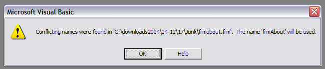



## What is 'Conflicting names were found\.\.\.\.'? \(update2\)

### Description

An occasional irritation when downloading is this messagebox appearing while loading a project.

This article and code demonstrate it and explain how to fix it.

The program in the zip has had this bug inserted deliberately, just click a button and continue to load.

The article is an html file so you can view it directly or read it from the demo program.

If you haven't seen this before you are lucky, just stick the article away somewhere for the day when you do face it.

----

The article also discusses some other ways to use NotePad to repair some other problems with VBP files.

----

Thanks Kevin Wigbels for finding another way to trigger this message and another place VB stores a FormName, I have updated the html file to include it and called this way of getting the msgbox Keven's bug in his honour ;).
 
### More Info
 

             |
---                |---
**Submitted On**   |2004-12-19 13:27:00
**By**             |[Roger Gilchrist](https://github.com/Planet-Source-Code/PSCIndex/blob/master/ByAuthor/roger-gilchrist.md)
**Level**          |Intermediate
**User Rating**    |5.0 (10 globes from 2 users)
**Compatibility**  |VB 5\.0, VB 6\.0
**Category**       |[Coding Standards](https://github.com/Planet-Source-Code/PSCIndex/blob/master/ByCategory/coding-standards__1-43.md)
**World**          |[Visual Basic](https://github.com/Planet-Source-Code/PSCIndex/blob/master/ByWorld/visual-basic.md)
**Archive File**   |[What\_is\_'C18321912222004\.zip](https://github.com/Planet-Source-Code/roger-gilchrist-what-is-conflicting-names-were-found-update2__1-57798/archive/master.zip)

